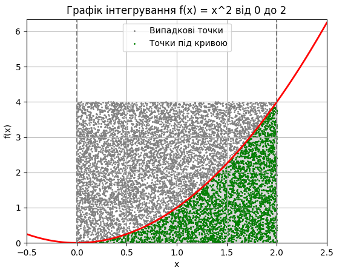

# Висновок

Обчислення інтегралу функції методом Монте-Карло показало наступні результати:

```
Кількість випадкових точок: 100

Метод          Результат                Похибка
=================================================================
Монте-Карло    2.960000                 0.293333
Аналітичний    2.666667                 0.000000

Кількість випадкових точок: 1000

Метод          Результат                Похибка
=================================================================
Монте-Карло    2.704000                 0.037333
Аналітичний    2.666667                 0.000000

Кількість випадкових точок: 10000

Метод          Результат                Похибка
=================================================================
Монте-Карло    2.630400                 0.036267
Аналітичний    2.666667                 0.000000

Кількість випадкових точок: 100000

Метод          Результат                Похибка
=================================================================
Монте-Карло    2.657360                 0.009307
Аналітичний    2.666667                 0.000000

```
Графік, який ілюструє метод Монте-Карло, наведено нижче:



Аналітичний розв'язок дає результат 2.666667

Як бачимо, метод Монте-Карло досить точно знаходить шукану площу і його можна використовувати для такого роду підрахунків, де з розрахунком напряму є складнощі.

Метод Монте-Карло базується на випадковому виборі точок у просторі і оцінює значення інтегралу шляхом вимірювання відсотка точок, що потрапляють під криву, відносно загальної кількості випадкових точок. З іншого боку, функція quad використовує чисельні методи для точного обчислення значення інтегралу. 

Як видно з результатів, метод Монте-Карло дає результат близький до аналітичного, але з певною похибкою, 
яка зменшується при збільшенні кількості випадкових точок. Тому кількість точок треба вибирати під конкретну задачу, здебільшого достатньо буде середньої кількості, щоб отримати результат, що буде задовольняти.